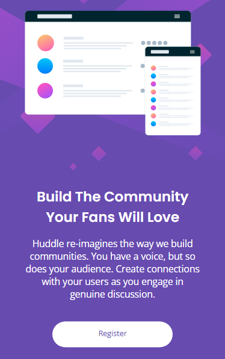
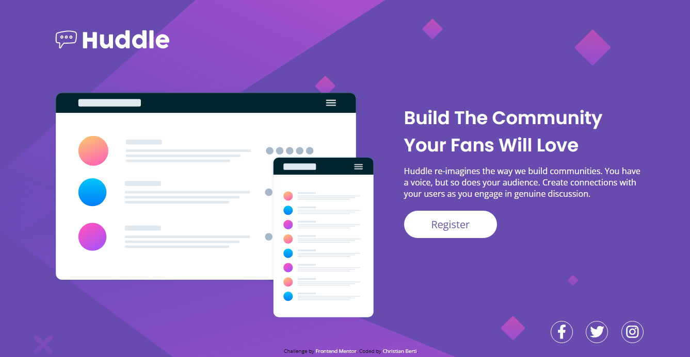
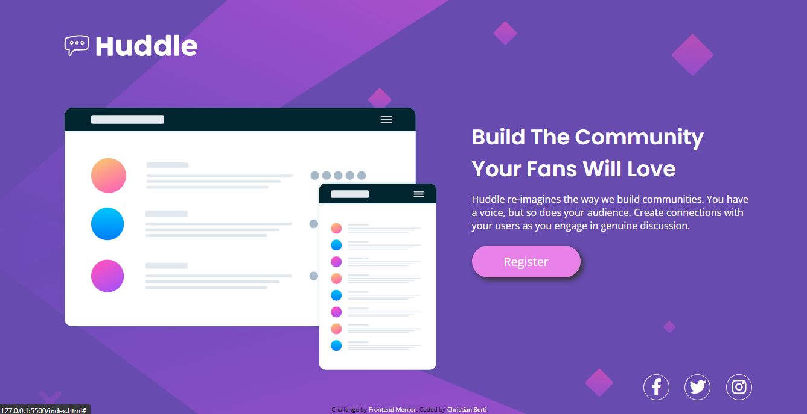

# Frontend Mentor - Huddle landing page with single introductory section solution

En este desafio de Frontend Mentor puse en practica lo aprendido en HTML y CSS. Hacer estos desafios me ayuda a incorporar conocimiento y repasar sobre aquellas cosas que no estoy tan seguro, preparandome para trabajar con proyectos cada vez mas avanzados.

### Desafio

Los usuarios deberian ver bien el contenido de la pagina sin importar en que dispositivo se encuentren y ademas deberian activarse los 'hovers' al pasar sobre el boton de registro o de redes sociales.

### Muestras del proyecto finalizado

### Proceso

Este desafio lo hice siguiendo un tutorial, el reto se trata de no seguir el tutorial al pie de la letra sino de intentar adelantarme a los pasos que siguen y resolverlo antes de ver la posible solucion. El tutorial me sirve para orientarme cuando estoy estancado, para ir avanzando de a poco y amigarme con el proceso. 

### Built with

- HTML
- CSS
- Flexbox

### Aprendizaje

Con cada uno de estos desafios que hice siento que aprendo un poco mas. No solo pongo en practica lo que sé sino que de a poco voy entendiendo mas sobre propiedades que no entendia del todo y puedo utilizarlas mejor. Ademas estos desafios me hacen tener que investigar sobre aquellas propiedades que desconozco casi por completo o no recuerdo como funcionan.
